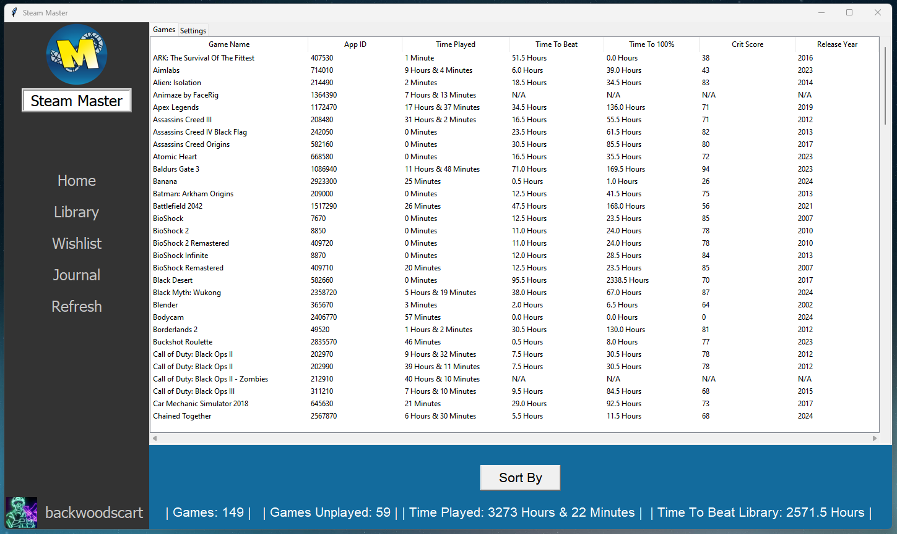

# Steam-Master
Program providing easy to read information about your Steam Profile. Includes Game Journal

## Includes
- Steam ID
- Number of Games in Your Library
- Number of Games in Your Library That You Haven't Played
- App IDs for All Games
- Time Played in Each Game
- Total Time Played
- Average Time it Takes to Beat Each Game
- Time it Would Take to Beat Your Entire Library
- Average Time it Takes to 100% Complete Each Game
- Critics Review Score of Each Game
- Release Year of Each Game
- A Game Journal

