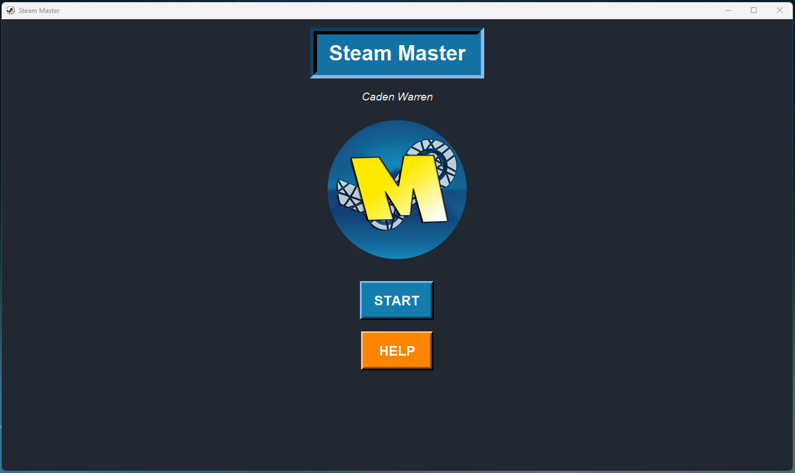

# Steam Profile Insights Program
Provides easy-to-read insights and statistics about your Steam profile, with detailed information to help you better understand your gaming habits and library. It also includes a customizable game journal for tracking your progress and reviews of games.

## Features

- Steam ID: Displays your unique Steam identifier.
- Total Games: Shows the number of games in your Steam library.
- Unplayed Games: Identifies how many of your games you haven't played yet.
- Game App IDs: Lists the App IDs for all games in your library.
- Time Played: Displays the time spent playing each game.
- Total Playtime: Calculates the cumulative playtime for all games in your library.
- Average Completion Time: Shows how long it typically takes most players to beat each game.
- Full Library Completion Time: Estimates how long it would take to beat every game in your library.
- 100% Completion Time: Provides an average estimate for fully completing each game (including achievements).
- Critics' Review Scores: Displays the review score of each game based on critics’ ratings.
- Release Year: Lists the release year of each game.
- Game Journal: Includes a personal game journal for recording notes, thoughts, or progress on each game.
- This program is ideal for gamers who want to analyze their Steam library, improve backlog management, and maintain detailed game records.

